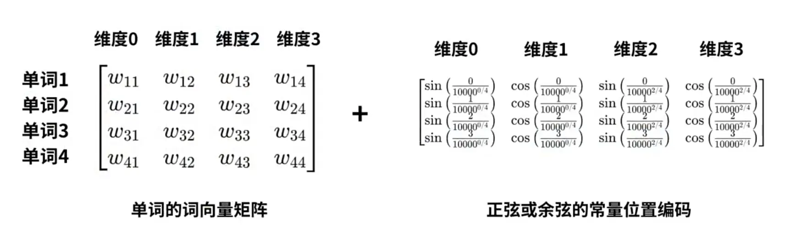
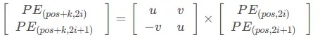

# DDPM

对应VAE的编码和解码，编码阶段DDPM对输入不断加高斯噪声，解码阶段则去噪，恢复原图。

在前向过程中，来自训练集的图像 ${x}_0$ 会被添加 $T$ 次噪声，使得 $x_T$ 为符合标准正态分布。根据${x}_t$和${x}_{t-1}$的关系，可以得到${x}_t$和${x}_{0}$之间的关系。公式中的$\beta_t$是一个大小变化的常数，$\beta_1$到$\beta_T$从小变大，论文中是[$10^{-4}, 0.02]$。$\beta_t$越来越大，$\alpha_t$越来越小，$\bar{\alpha}_t$越来越接近0。最终${x}_t = \epsilon$。

$$
\begin{align}

{x}_t \sim \mathcal{N}(\sqrt{1-\beta_t}x_{t-1},\beta_t\mathbf{I}) &\Rightarrow
{x}_t = \sqrt{1-\beta_t} {x}_{t-1} + \sqrt{\beta_t} \epsilon_{t-1} &其中 \epsilon_{t-1} \sim \mathcal{N}(0, {I}) \\

{x}_t &= \sqrt{\bar{\alpha}_t} {x}_0 + \sqrt{1- \bar{\alpha}_t} \epsilon_t 

&令 \alpha_t = 1 - \beta_t，\bar{\alpha}_t = \prod_{i=1}^t{\alpha_i}
\end{align}
$$

根据贝叶斯公式，有如下公式。

$$
\begin{align}
q(x_{t-1}|x_t, x_0) &= \frac{q(x_t|x_{t-1}, x_0)q(x_{t-1}|x_0)}{q(x_t|x_0)} \\
q(x_t|x_{t-1}, x_0) &= \mathcal{N}(\sqrt{1-\beta_t}x_{t-1}, \beta_t\mathbf{I}) \\
q(x_t|x_0) &= \mathcal{N}(\sqrt{\bar{\alpha_t}}x_0, (1-\bar{\alpha_t})\mathbf{I}) \\
q(x_{t-1}|x_0) &= \mathcal{N}(\sqrt{\bar{\alpha}_{t-1}}x_0, (1-\bar{\alpha}_{t-1})\mathbf{I}) 
\end{align}
$$

根据高斯分布的概率密度函数

$$
X \sim N(\mu,\sigma^2)时，f(x) = \frac{1}{2\pi\sigma}exp(-\frac{(x-\mu)^2}{2\sigma^2})
$$

$$
q(x_t|x_{t-1}, x_0) \propto \exp[-\frac{1}{2}\frac{(x_t-\sqrt{1-\beta_t}x_{t-1})^2}{\beta_t}]
$$

于是(3)式的右边就等于

$$
\begin{align}
&\exp[
-\frac{1}{2}(\frac{(x_t-\sqrt{1-\beta_t}x_{t-1})^2}{\beta_t} 
+ \frac{(x_{t-1}-\sqrt{\bar{\alpha}_{t-1}}x_0)^2}{1-\bar{\alpha}_{t-1}}) 
- \frac{(x_{t}-\sqrt{\bar{\alpha}_t}x_0)^2}{1-\bar{\alpha}_t}+
]\\
=&\exp[-\frac{1}{2}((\frac{\alpha_t}{\beta_t} + \frac{1}{1-\bar{\alpha}_{t-1}})x_{t-1}^{2} - 
(\frac{2\sqrt{\alpha_t}}{\beta_t}x_t + \frac{2\sqrt{\bar{\alpha}_{t-1}}}{1-\bar{\alpha}_{t-1}})x_{t-1} + C(x_t, x_0))]
\end{align}
$$

于是，方差就是$1/(\frac{\alpha_t}{\beta_t} + \frac{1}{1-\bar{\alpha}_{t-1}})=\frac{1-\bar{\alpha}_{t-1}}{1-\bar{\alpha}_t} \cdot \beta_t$，是一个常量。

均值为$\left(\frac{\sqrt{\alpha_t}}{\beta_t} {x}_t+\frac{\sqrt{\bar{\alpha}_{t-1}}}{1-\bar{\alpha}_{t-1}} {x}_0\right) /\left(\frac{\alpha_t}{\beta_t}+\frac{1}{1-\bar{\alpha}_{t-1}}\right)  =  \frac{\sqrt{\alpha_t}\left(1-\bar{\alpha}_{t-1}\right)}{1-\bar{\alpha}_t} {x}_t+\frac{\sqrt{\bar{\alpha}_{t-1}} \beta_t}{1-\bar{\alpha}_t} {x}_0  =  \frac{1}{\sqrt{\alpha_t}}\left(x_t-\frac{1-\alpha_t}{\sqrt{1-\bar{\alpha}_t}} \epsilon_t\right)$  

也就是说，在已知$x_0$的情况下，利用$x_t$和$\epsilon_t$就可以求出来$x_{t-1}$，在T时刻，$x_t$是已知的，这样只要预测$\epsilon_t$就可以得到$x_{t-1}$了。

于是神经网络的优化目标就是$L=||\epsilon_t - \epsilon_{\theta}(x_t, t)||^2$，其中的$x_t$可以根据$x_0$算出来$x_t = \sqrt{\bar{\alpha}_t} {x}_0 + \sqrt{1- \bar{\alpha}_t} \epsilon_t$。

‍

另外，在实现中值得注意的是timestep注入Unet的形式，sinusodial位置编码：

$$
PE(pos, 2i) = sin(\frac{pos}{10000^{2i/d_model}})\\
PE(pos, 2i+1) = cos(\frac{pos}{10000^{2i/d_model}})
$$

如下图所示

使用了该位置编码之后，pos+k的编码可以用pos的编码线性表示。

$$
PE(pos+k, 2i) = sin(w_i(pos+k)) = sin(w_ipos)cos(w_ik) + cos(w_ipos)sin(w_ik)\\
PE(pos+k, 2i+1) = cos(w_i(pos+k) = cos(w_ipos)cos(w_ik) - sin(w_ipos)sin(w_ik)
$$

即

‍
