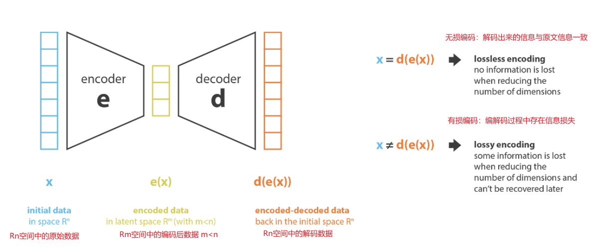
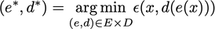
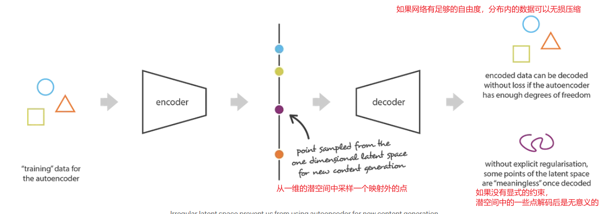
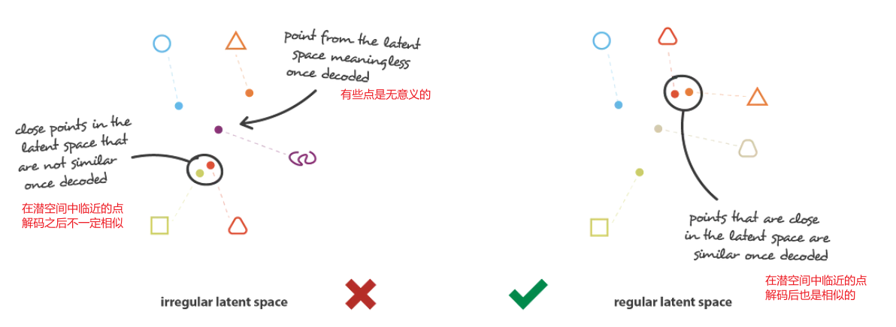
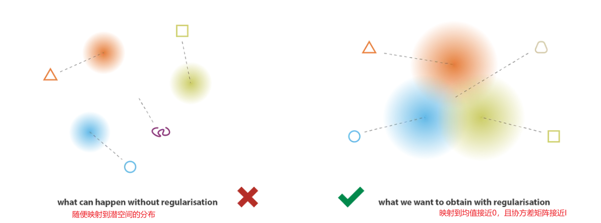
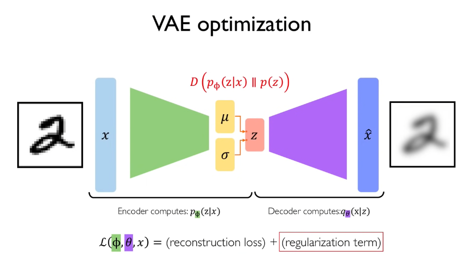
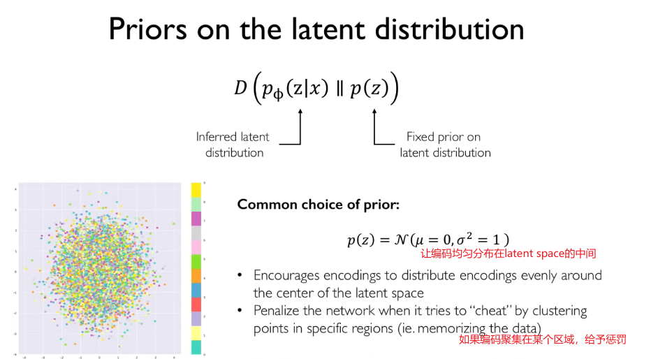
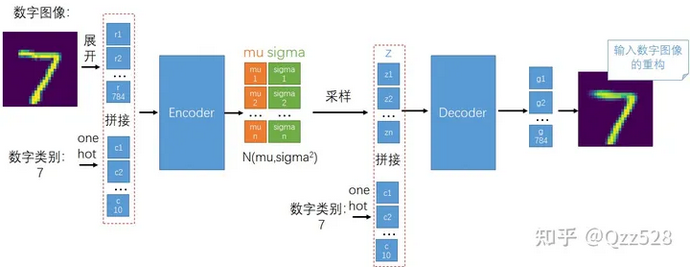
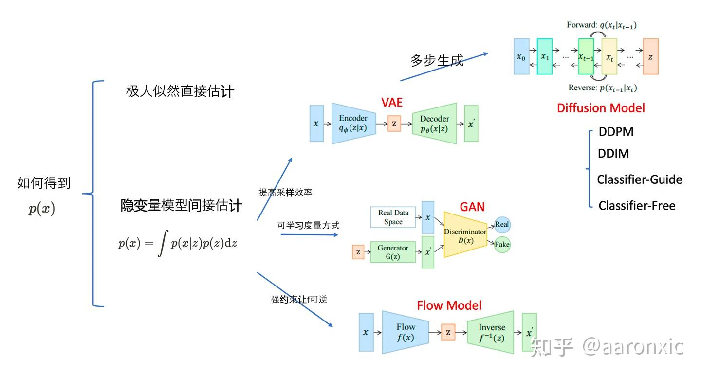

# VAE

> [写的](https://towardsdatascience.com/understanding-variational-autoencoders-vaes-f70510919f73)很好，现在是我的了
>
> [这个](https://towardsdatascience.com/reparameterization-trick-126062cfd3c3)有vae的网络结构，[这个](https://medium.com/@rekalantar/variational-auto-encoder-vae-pytorch-tutorial-dce2d2fe0f5f)是pytorch的

从降维的角度来理解autoencoder。降维的目的是找到最佳的编码器和解码器，使得损失最小。这里有两个子问题：

1. 编码后最大化地保留信息
2. 解码后最大化地恢复信息

优化目标如下，$\epsilon$表示重构误差。

直观地说，整个自动编码器架构（编码器+解码器）为数据创建了一个==瓶颈，确保只有信息的主要结构化部分可以通过并被重建==。

在这种情况下，架构越复杂，自动编码器就越能进行高维数降低，同时保持较低的重建损失。如果我们的编码器和解码器有足够的自由度，我们可以将任何初始维度减少到 1。具有“无限能力”的编码器理论上可以采用我们的 N 个初始数据点并将它们编码为 1, 2, 3， ...N。

但是，自动编码器的问题在于，潜空间是无组织的。如果在原始数据在潜空间的分布外采样一个点，得到的图像是无意义的。

VAE通过约束潜空间的分布为正态分布，保证了潜空间的连续性和完整性。

值得注意的是，如果仅仅是将原始数据映射到一个分布，而不对分布的具体形式进行约束（即只对latent加噪声，而不加KL Loss），也是不行的。

变分推理 (VI) 是一种近似复杂分布的技术。这个想法是设置一个参数化的分布族（例如高斯族，其参数是均值和协方差），并在该族中寻找目标分布的最佳近似值。系列中最好的元素是最小化给定近似误差测量（大多数情况下近似值与目标之间的 Kullback-Leibler 散度）的元素，并且通过描述该系列的参数的梯度下降来找到。

如果我们要让编码器得到的分布和一个标准高斯接近，就要最小化 $KL(p(z|x), p(z))$. [ref](https://www.youtube.com/watch?v=rZufA635dq4&t=1091s)

VAE的名字中“变分”，是因为它的推导过程用到了KL散度及其性质。

# 从概率角度理解

前置知识：[贝叶斯公式](VAE/bayes.md)

已知我们可以将d个高斯，通过一个足够复杂的映射，得到一个任意复杂的d维分布。

生成，就是通过让模型看到训练数据，让生成出来的数据像训练数据的概率最大化。$P(X)$指的是模型生成样本X的概率。

$P(X) = \int{P(X|z;\theta)P(z)dz}$  

但是如果我们在z所属的空间做采样，这里面需要枚举所有的z才能优化好这个积分，使得P(X)最大化，比较费劲。

实际上大部分的z对优化都没啥贡献，我们只需要考虑一些“好z”就可以了。这个时候我们可以考虑一个新的函数$Q(z|X)$，这里的直觉是，通过一个采用X作为输入的复杂函数得到的z，会比简单的高斯z更“好”，也就是更容易通过另外一个复杂的映射得到一个像X的输出。

对于真实的“好z”分布$P(z|X)$，==这里使用P，而不是其他的符号，因为这个P是同生成过程绑定的，是生成的X的分布==。

对于两个任意的分布，他们有个KL散度的定义：

$$
\begin{align}
D[Q(z)||P(z|X)] &= E_{z\sim Q}[\log Q(z) - \log P(z|X)] \\
\end{align}
$$

其中$P(z|X)=P(X|z)P(z)/P(X)$（贝叶斯公式）。

$$
\begin{align}
E_{z\sim Q}[\log Q(z) - \log P(z|X)] &= E_{z \sim Q}[\log Q(z) - \log P(X|z) - \log P(z)] + \log P(X) \\
D[Q(z)||P(z|X)] &= E_{z \sim Q}[\log Q(z) - \log P(X|z) - \log P(z)] + \log P(X) \\
\log P(X) - D[Q(z)||P(z|X)] &= -E_{z \sim Q}[\log Q(z) - \log P(X|z) - \log P(z)] \\
\log P(X) - D[Q(z)||P(z|X)] &= -E_{z \sim Q}[\log Q(z) - \log P(X|z) - \log P(z)] \\
\log P(X) - D[Q(z)||P(z|X)] &= E_{z \sim Q}[\log P(X|z)] -E_{z \sim Q}[\log Q(z)  - \log P(z)]  \\
\log P(X) - D[Q(z)||P(z|X)] &= E_{z \sim Q}[\log P(X|z)] - D[Q(z)||P(z)]
\end{align}
$$

最后的结果单独拿出来：

$$
\log P(X) - D[Q(z)||P(z|X)] = E_{z \sim Q}[\log P(X|z)] -D[Q(z)||P(z)]
$$

可以构建一个依赖于$X $的$Q(z)$，也就是：

$$
\log P(X) - D[Q(z|X)||P(z|X)] = E_{z \sim Q}[\log P(X|z)] -D[Q(z|X)||P(z)]
$$

$\log P(x)$就是我们需要最大化的，生成像X的概率，D是我们需要最小化的，输入X，得到好z。$Q(z|X)$一般定义成$N(z|\mu(X;\theta), \Sigma(X;\theta))$，这样Q(z)就和X搭上边了。

如果是条件vae的话，就是要算给定Y的条件下的X，改一下上面的公式可以得到：

$$
\log P(X|Y) - D[Q(z|X,Y)||P(z|X,Y)] = E_{z \sim Q(\cdot |X,Y)}[\log P(X|z,Y)] -D[Q(z|X,Y)||P(z|Y)]
$$

关于VAE，GAN的相同点：

> VAE、GAN 这种生成模型和 transformer 有什么区别？ - aaronxic的回答 - 知乎  
> https://www.zhihu.com/question/558574918/answer/3144394562

VAE的贡献在于对隐变量采样效率的提高。Diffusion把一步变成多步。  
GAN的贡献是使用更好的度量方法。

Flow模型本质上是找一个可逆的函数（但是因为可逆这个条件比较苛刻，所以网络的表达能力不是很强）。不过最近，flow matching技术又让flow模型焕发第二春了。

