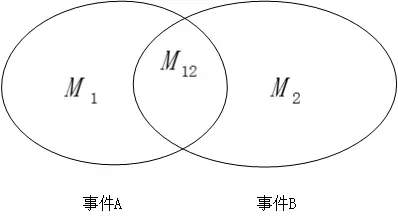
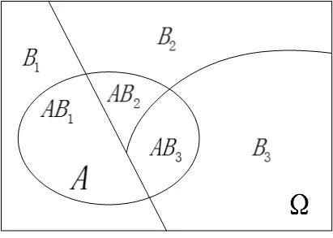
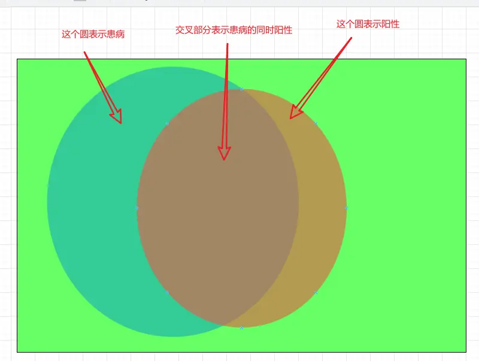

# 贝叶斯公式

>  https://www.zhihu.com/question/29155526/answer/1790406222

投一个骰子，投出5的概率是1/6。已知投出来的是奇数，问投出来是5的概率是多少，答案是1/3。  
我们一般不会直接去推断一个事件发生的可能性，因为这样实际意义并不明显，而且也不容易推断出结果，比如我们问你今天下雨的概率是多大？你可能是一头雾水，什么地点？什么月份？当日云层的厚度？这些条件都没有告诉，我想是无法给出一个有意义、有价值的合理推断的。

假定一个试验有 **N** 个等可能的结果，事件 **A** 和 **B** 分别包含 **M1** 个和 **M2** 个结果，这其中有 **M12** 个结果是公共的，这就是同时发生事件 **A** 和事件 **B** ，即 **A∩B** 事件所包含的试验结果数。

事件A和B发生的概率是M1/N和M2/N，已知事件B发生的情况下，事件A发生的概率是P(A|B)=M12/M2。

$P(A|B)=\frac{M_{12}}{M_2}=\frac{M_{12}/N}{M_2/N}=\frac{P(AB)}{P(B)}$  

P(A|B)是指B里面A的比例，而P(AB)是指 $\Omega $ 里面 AB的比例。所以P(AB) = P(A|B)*P(B)可以理解为：AB占总体的比例=B占总体的比例×B里面A占B的比例。假如B占1/3，B里面的A占1/4，拿么AB应该占总体的1/12。

如果两个事件时独立的，则P(A|B)=P(A)，也有P(AB) = P(A) * P(B)。这里需要注意的是，==独立描述的不是事件之间的关系，而是概率之间的关系，所以独立这种东西，不能用韦恩图来描述==。

考虑上图，$P(A) = P(AB_1) + P(AB_2) + P(AB_3)$，其中$P(AB_1) = P(B_1)P(A|B_1) $，所以 $P(A) = P(B_1)P(A|B_1)+P(B_2)P(A|B_2)+P(B_3)P(A|B_3) $。

这里我认为有一个重要的点，**为什么要把AB的概率分成B的概率和条件概率的乘积？因为条件概率是人类更加直观能感受到的**！！！

大多数情况下，人类都是已知某一个条件下，某个事情发生的概率。而贝叶斯公式，则是求事情发生的条件下，某一个条件的概率。即由果推因。

$$
P(B_i|A) = \frac{P(AB_i)}{P(A)}=\frac{P(A|B_i)P(B_i)}{P(A)}=\frac{P(A|B_i)P(B_i)}{P(A|B_1)P(B_1)+P(A|B_2)P(B_2)+P(A|B_3)P(B_3)}
$$

这里面，

$P(B_i)$称为先验概率，表示没有别的信息下得到的概率信息，一般由经验估计得到。

$P(B_i|A)$称为后验概率，表示获得了信息A之后$B_i$出现的概率，代表了获得信息之后对先验概率的一种修正。

比如那个经典的例子，本来一个疾病的发病率很低，但是一个病人测得阳性，求这个时候他阳性是因为发病了的概率。

假设一个病的发病率为0.01，如果有人得这个病，测出来的概率是0.95，如果没得，有时候也会测出阳性，概率是0.05。

P(患病）= 0.01

P(阳性|患病）=0.95

P(阳性|未患病）=0.05

P(阳性）= P(阳性|患病)×P(患病) + P(阳性|未患病）×P(未患病）=0.95*0.01 + 0.05 * 0.99 = 0.059

P(患病|阳性）=P(患病 & 阳性）/ P(阳性）= P（患病）×P（阳性|患病） / P（阳性）= 0.01*0.95/0.059=0.16

‍
