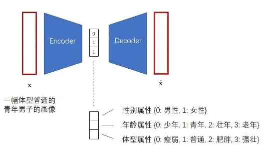
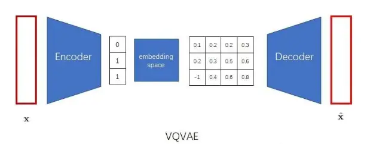
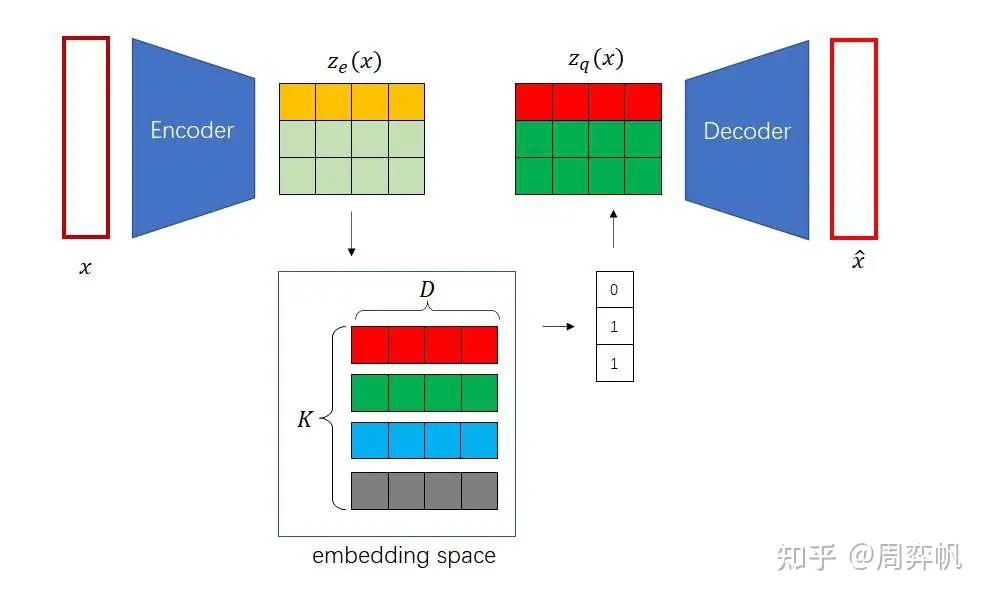

# VQVAE

VAE生成出来的图片都不是很好看。VQ-VAE的作者认为，VAE的生成图片之所以质量不高，是因为图片被编码成了连续向量。而实际上，把图片编码成**离散向量**会更加自然。比如我们想让画家画一个人，我们会说这个是男是女，年龄是偏老还是偏年轻，体型是胖还是壮，而不会说这个人性别是0.5，年龄是0.6，体型是0.7。因此，VQ-VAE会把图片编码成离散向量，如下图所示。

把图像编码成离散向量后，又会带来两个新的问题。  
第一个问题是，神经网络会默认输入满足一个连续的分布，而不善于处理离散的输入。如果你直接输入0, 1, 2这些数字，神经网络会默认1是一个处于0, 2中间的一种状态。为了解决这一问题，我们可以借鉴NLP中对于离散单词的处理方法。为了处理离散的输入单词，NLP模型的第一层一般都是词嵌入层，它可以把每个输入单词都映射到一个独一无二的连续向量上。这样，每个离散的数字都变成了一个特别的连续向量了。

离散向量的另一个问题是它不好采样。VQ-VAE根本不是一个图像生成模型。它和AE一样，只能很好地完成图像压缩，把图像变成一个短得多的向量，而不支持随机图像生成。

通过离散化，表示被限制在有限个离散值中，这大大减少了可能的表示空间，限制了模型的复杂度，类似于正则化中常见的限制模型参数的方式。所以VQ也是正则化的一种。

VQ-VAE使用了如下方式关联编码器的输出与解码器的输入：假设嵌入空间已经训练完毕，对于编码器的每个输出向量$z_e(x)$，找出它在嵌入空间里的最近邻$z_q(x)$，把$z_e(x)$替换成$z_q(x)$作为解码器的输入。

Loss用$z_q(x)$来算，梯度用$z_e(x)$来算。Embedding space的每个向量是$z_e(x)$的聚类中心（也就是说，VQVAE的实际上是tokenizer+embedding）。同时，我们希望$z_q $靠近$z_e$，而不是$z_e$靠近$z_q$，于是

$$
\beta||sg[z_e(x)]-z_q(x)||_2^2 + \gamma||z_e(x)-sg[z_q(x)]||_2^2
$$

通过控制$\beta$和$\gamma$的大小来控制。$sg$函数是前向时生效，反向时不生效。因为$sg(z_e)$就相当于固定$z_e$，优化另外的。

‍
