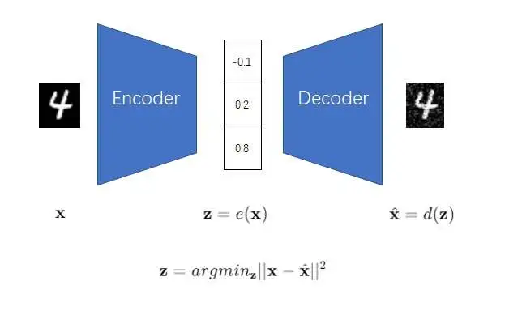
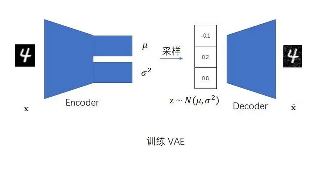
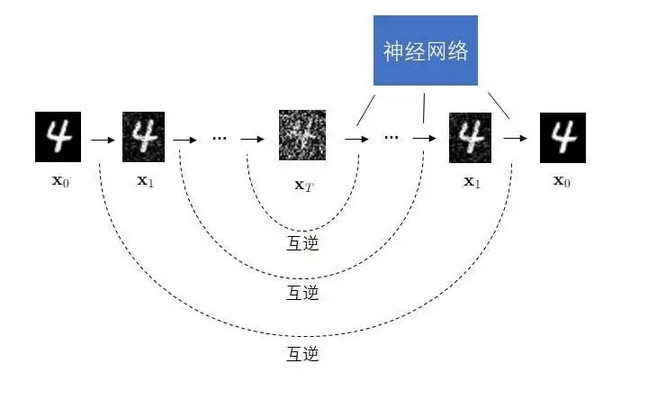
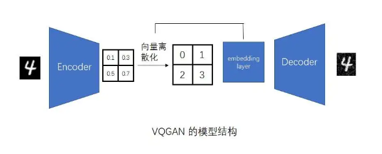

# Stable diffusion历史

> 本文大部分内容参考/摘自 [天才程序员周弈帆](https://zhuanlan.zhihu.com/p/676705162) 的文章,感谢作者的精彩分享。

### AE (Auto Encoder, 自动编码器)

所谓自动编码器,其实就是自动压缩器。先把图片压缩到一个小向量,然后再从小向量中解压。
网络结构设计成一个漏斗形,这样就只有重要的特征能保留下来,无关的噪声被剔除。
训练目标就是让解压之后的图片和压缩前的图片长的差不多。
**但是这个模型不能用来做生成**,想要做生成,就得给定一个z,如果随便搞一个随机噪声向量z,显然没法从一个随机噪声解压出一个图片来。

### [VAE (Variational Autoencoder,变分自编码器)](VAE.md)

在AE的基础上添加一个约束,使得压缩之后的图片接近正态分布。这样就可以从任意正态分布解压出图片。这样,训练目标就变成了:

1. 解压出来的图跟原图相似
2. 压缩出来的向量跟正态分布相似

同时，中间的正态分布约束也是一种[正则化](正则化.md)的方法。
**但是这个模型生成出来的图片很糊**,因为只约束了全图的均方差。(看了扩散模型的介绍,我觉得vae还有个问题就是压缩的太过了,相对来说,vqgan可能好一点,但是还是太过了)

### [DDPM (Denoising Diffusion Probabilistic Model)](DDPM.md)

去掉可学习的编码器,把原图多次加噪声,得到正态分布,神经网络学习多次去噪。
所谓的学习去噪就是输入图片,预测噪声,预测出来的噪声要跟真实的噪声差不多。
**但是这个操作都是在相同尺寸的图片上跑的,** 如果要直接生成高清大图,显存扛不住(即使到了sd的年代,大众的硬件也就能抗住64*64)。

### [VQVAE &amp; VQGAN](VQVAE.md)

AE其实把图片压缩成了一维向量，VQVAE可以把图片压缩成[离散](离散.md)​[二维](二维.md)向量，相当于一个按比例缩放的小图。为了用VQVAE生成图像需要：

1. 训练：先训练一个图像压缩模型 VQVAE，再训练一个生成小图的[Transformer](Transformer.md)模型。
2. 生成：用Transformer生成小图，然后用Decoder放大。

Transformer一次生成16x16的图片，decoder可以放大16倍，最终生成256x256的图。
因为只考虑了全图的重建误差，VQVAE生成的图还是糊糊的。
VQGAN在VQVAE的基础上用[感知误差](感知误差.md)替换了重建误差，还加上了[patch的对抗误差约束](patch的对抗误差约束.md)，使得图像变得清晰。

### Stable Diffusion

→ [结构详解](sd-structure.md)

DDPM + VQGAN 的组合：先用 DDPM 生成 64×64 小图，再用 VAE/VQVAE 的 Decoder 放大 8 倍到 512×512。

核心贡献：用 DDPM 生成语义，让 Decoder 补充细节；文本约束通过 Cross Attention 注入生成过程。

‍
