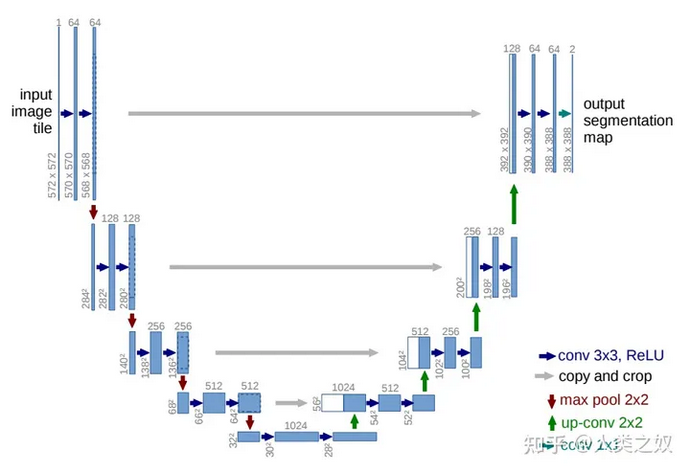
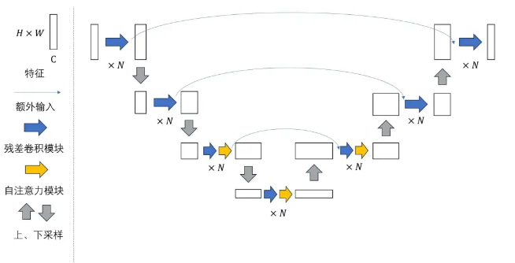
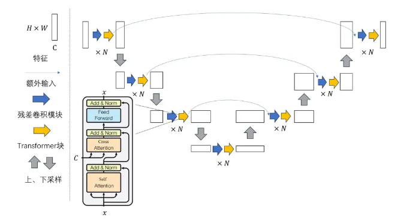

# Stable diffusion结构

## [整体架构](https://zhuanlan.zhihu.com/p/613337342)

### 使用UNet做DDPM

- 原始[UNet结构](unet-structure.md)

- DDPM中的UNet结构

  - 普通卷积替换成带[残差](residual-conv.md)的卷积，比较深的层还有[cross attention](cross-attention.md)加持
  - 更加密集的原始信息：每个大层的下采样部分的每个子模块都会输入到对称的上采样部分

- Stable diffusion中的[UNet结构](unet-structure.md)，每一层都有[cross attention](cross-attention.md)加持

