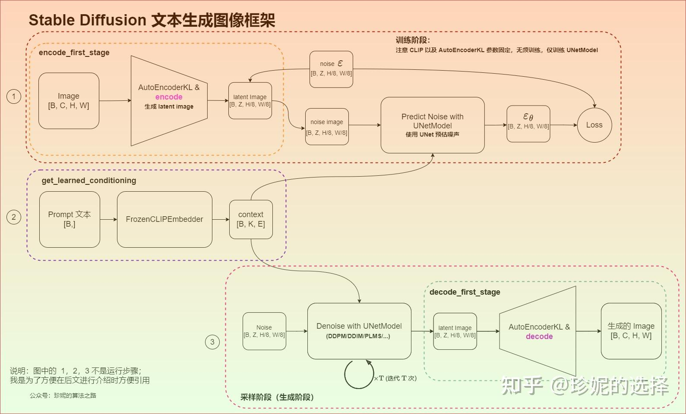
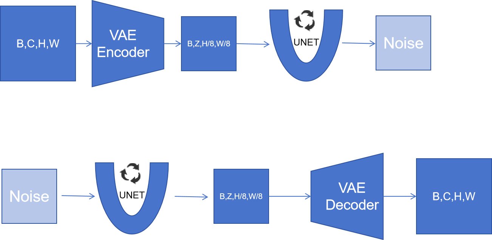

# Stable diffusion结构

## [整体架构](https://zhuanlan.zhihu.com/p/613337342)

DDPM + VQGAN 的组合：先用 DDPM 生成 64×64 小图，再用 VAE/VQVAE 的 Decoder 放大 8 倍到 512×512。

文章对 DDPM 怎么搭配 VAE 提供了自己的思路：扩散模型的生成分为两个阶段，先生成语义，再生成细节，大部分时间都被用来生成细节了。DDPM 搭配 VAE 使用时，可以只生成语义，让 Decoder 补充细节。

两个贡献：

1. 用 DDPM 生成小图，然后再放大，效果非常好。
    1. 避免了直接用 DDPM 生成大图爆显存。
    2. DDPM 用 UNet，此时还是很适合用来做二维图像任务。VQGAN 用激进的 Transformer 压缩，有损。
    3. 压缩模型（VAE 或者 VQVAE）通用，模型表达能力好。以前的两阶段生成模型容量不太行，换一个任务就得换一个网络。
2. 带约束的图像生成：文本约束用交叉注意力注入到 DDPM 的生成过程中，图像约束则把约束图像拼在小图上。

### [UNet 结构](unet-structure.md)

从原始 UNet 到 DDPM UNet 再到 Stable Diffusion UNet 的演进：下采样提取特征、上采样恢复分辨率、跳连传递细节。

### [Cross Attention](cross-attention.md)

文本条件注入图像生成的关键机制。DDPM 中只在深层加入，Stable Diffusion 中每一层都有，控制更精细。

### [残差卷积](residual-conv.md)

普通卷积替换为带残差连接的卷积块，训练更稳定、网络可以更深，时间步嵌入也由此注入。
